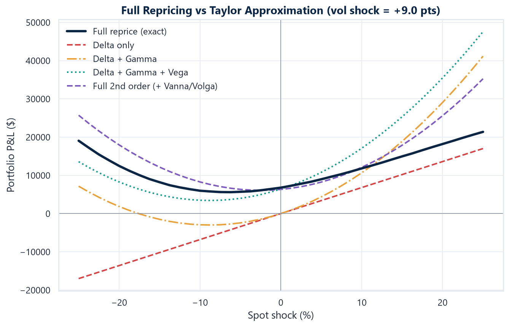
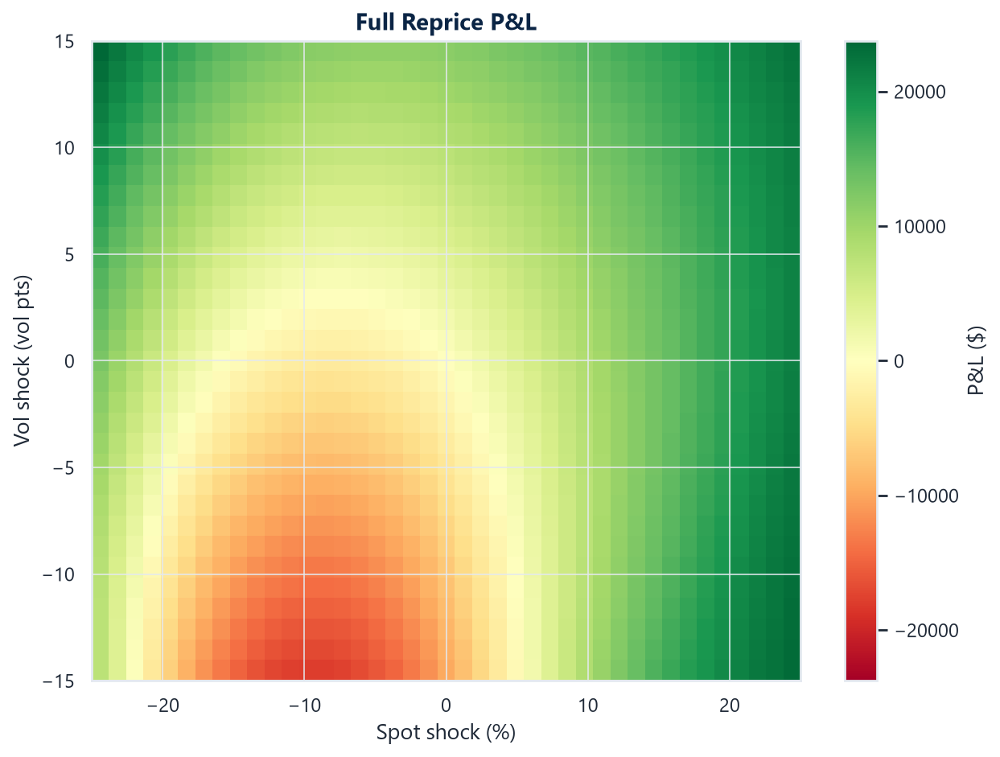
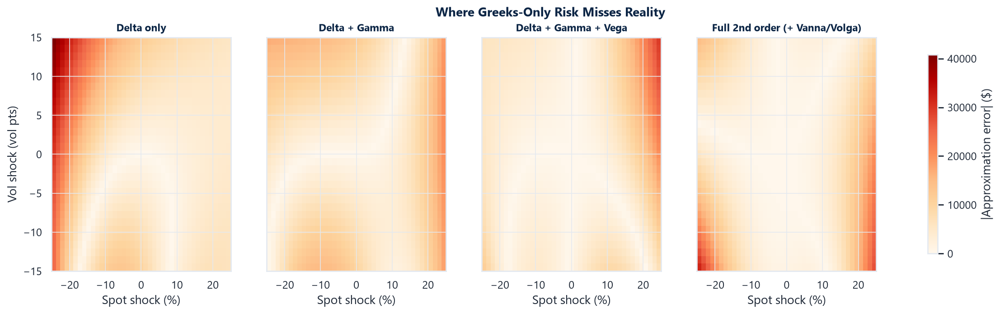
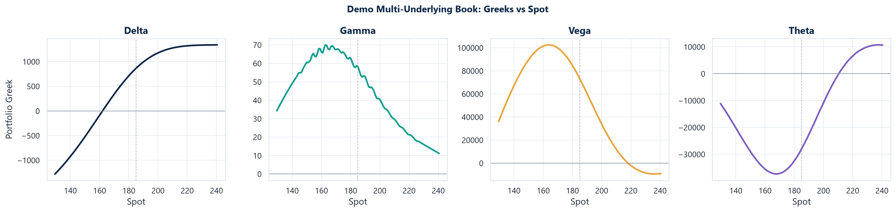
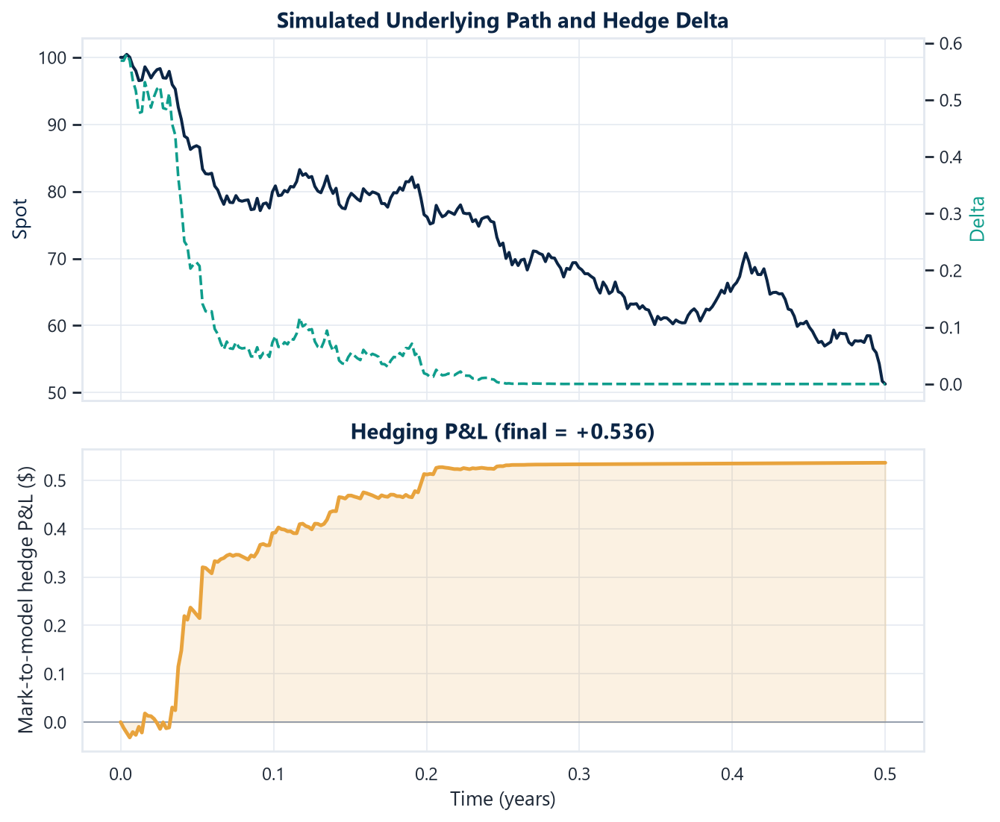
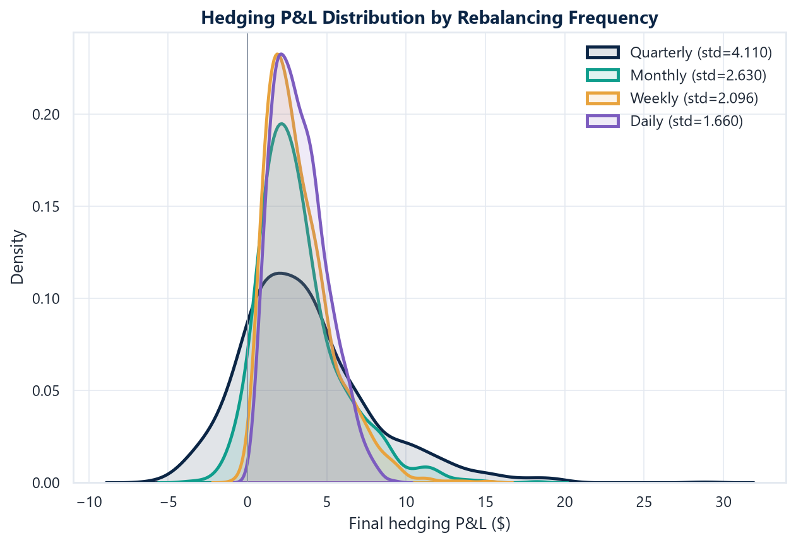
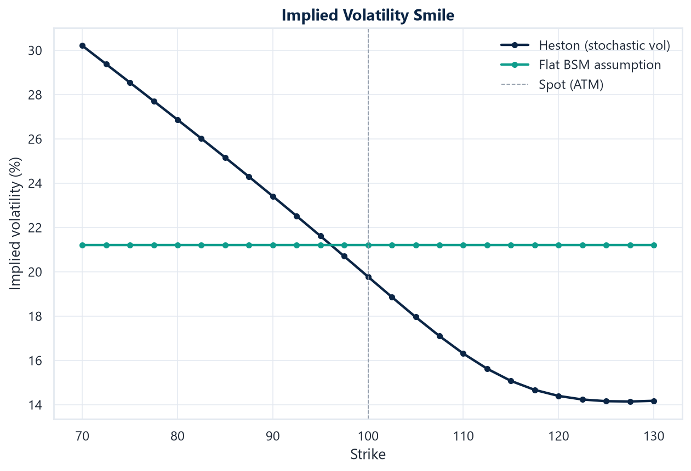

# Options Pricing & Risk Engine


A Python engine for **portfolio option pricing, Greeks, scenario analysis and delta-hedging**, built on Black-Scholes-Merton and Black-76, with binomial, Monte Carlo and Heston stochastic-volatility models layered on top.

The centerpiece analysis: **full repricing vs. Taylor-series Greek approximation** under spot and volatility shocks — a direct, quantitative measure of the nonlinear risk a Greeks-only view misses.

<p align="center"></p>

## Why this chart is the point

A Delta+Gamma risk report says a portfolio's P&L is a parabola. It isn't — Vega, Vanna and Volga bend it further, and every Taylor order eventually breaks down for a large enough move. The chart above **is** that gap, made visible: four approximation orders peeling away from the exact repriced P&L (black) as the shock grows. Everything below exists to make that comparison rigorous, fast, and explorable interactively.

## Highlights

- **Five pricing models, cross-validated against each other** — Black-Scholes-Merton, Black-76, a CRR binomial tree (American exercise), Monte Carlo (antithetic + control variate), and Heston stochastic volatility via the Fang-Oosterlee COS method — instead of trusting a single implementation, or memorized reference prices.
- **Full Greeks suite**: closed-form Delta, Gamma, Vega, Theta, Rho, Vanna, Volga, plus a shared finite-difference engine for Charm, Speed, Zomma, Color — and for any model without a closed form at all.
- **Portfolio scenario engine**: full repricing vs. increasing Taylor-series orders (Δ → Δ+Γ → Δ+Γ+Vega → full 2nd order) across a spot/vol shock grid, with P&L and error surfaces.
- **Delta-hedging simulator**: discrete rebalancing under a realized vol that can differ from the implied hedging vol, across rebalancing frequencies, demonstrating the realized/implied variance P&L relationship empirically.
- **Heston vol smile**: a flat BSM assumption can't produce a skew; Heston can — priced semi-analytically (no Monte Carlo needed) via a Fourier-cosine series inversion of the characteristic function.
- **Interactive Streamlit dashboard** and a **static chart library** (matplotlib/seaborn + Plotly) sharing one visual theme.
- **165 tests**, none of them asserting a hand-typed "trust me" number — see [Testing philosophy](#testing-philosophy).

## Gallery

<table>
<tr>
<td width="33%"><br><sub>Full-reprice P&L over the spot/vol shock grid</sub></td>
<td width="33%"><br><sub>Where each Taylor order's error is largest</sub></td>
<td width="33%"><br><sub>Portfolio Greeks vs. spot</sub></td>
</tr>
<tr>
<td width="33%"><br><sub>One simulated delta-hedging path</sub></td>
<td width="33%"><br><sub>Hedging error shrinks with rebalancing frequency</sub></td>
<td width="33%"><br><sub>Heston-implied smile vs. a flat BSM assumption</sub></td>
</tr>
</table>

## Quickstart

```bash
git clone <this-repo>
cd "options n greeks"
python -m venv .venv
.venv\Scripts\activate          # Windows; use `source .venv/bin/activate` on macOS/Linux
pip install -e ".[dev,app,notebook]"

pytest                                        # 165 tests
python scripts/generate_report_assets.py      # regenerate every chart in assets/
streamlit run app/dashboard.py                # interactive dashboard
jupyter notebook notebooks/demo.ipynb         # narrative walkthrough
```

## The dashboard

```
streamlit run app/dashboard.py
```

Five tabs over either the bundled demo book or a portfolio you build live in the sidebar:

| Tab | What it shows |
|---|---|
| 📋 Portfolio Summary | Position table, net Greeks, payoff-at-expiry diagram |
| 📐 Greeks Explorer | Portfolio Greeks vs. spot, adjustable range/resolution |
| 🌋 Scenario Analysis | Interactive 3D P&L surface + the full-reprice-vs-Taylor slice chart, live sliders for shock ranges and grid resolution |
| ⚖️ Delta-Hedging Simulator | One simulated hedge path + P&L distribution across rebalancing frequencies, for your own spot/strike/vol inputs |
| 🌊 Vol Smile (Heston) | Live Heston parameter sliders vs. a flat BSM assumption |

## A quick example

```python
from optrisk.instruments.option import MarketEnv, OptionSpec
from optrisk.instruments.portfolio import Portfolio, Position
from optrisk.risk.scenarios import default_shock_grid, run_scenario_analysis

market = MarketEnv(spot=100.0, rate=0.04, vol=0.25, dividend_yield=0.01)
call = OptionSpec(option_type="call", strike=105.0, expiry=0.5)

portfolio = Portfolio().add(Position(call, quantity=10, market=market, multiplier=100))

spot_shocks, vol_shocks = default_shock_grid(spot_range_pct=0.2, n_spot=21, vol_range=0.1, n_vol=11)
result = run_scenario_analysis(portfolio, spot_shocks, vol_shocks)

print(f"Portfolio value: ${portfolio.value():,.2f}")
print(f"Net Greeks: {portfolio.greeks()}")
print(f"Max Delta-only approximation error: ${result.max_abs_error('delta'):,.2f}")
```

## Architecture

```mermaid
flowchart LR
    subgraph models["models/"]
        BSM["Black-Scholes-Merton"]
        B76["Black-76"]
        BIN["Binomial (American)"]
        MC["Monte Carlo"]
        HES["Heston (COS method)"]
    end
    subgraph greeks["greeks/"]
        AN["Closed-form: Δ Γ Vega Θ ρ Vanna Volga"]
        NUM["Finite-difference engine: Charm Speed Zomma Color"]
    end
    subgraph instr["instruments/"]
        OPT["OptionSpec + MarketEnv"]
        PORT["Portfolio + Position"]
    end
    subgraph risk["risk/"]
        SCN["Scenario engine\nfull reprice vs Taylor approx"]
        HDG["Delta-hedging simulator"]
    end
    subgraph out["viz/ + app/"]
        PLOTS["Static charts\n(matplotlib/seaborn)"]
        DASH["Streamlit dashboard\n(Plotly)"]
    end

    models --> greeks --> instr
    models --> instr
    instr --> risk
    risk --> out
```



```
src/optrisk/
├── models/       black_scholes.py, black76.py, binomial.py, monte_carlo.py, heston.py, implied_vol.py
├── greeks/       analytical.py (closed-form), numerical.py (finite-difference engine), types.py
├── instruments/  option.py (OptionSpec, MarketEnv, Stock), portfolio.py (Position, Portfolio)
├── risk/         scenarios.py (full reprice vs Taylor approx), hedging.py (delta-hedge simulator)
├── viz/          theme.py, plots.py (matplotlib + Plotly chart library)
└── market/       sample_data.py (synthetic demo portfolio, no external data needed)

app/dashboard.py                   Streamlit app
scripts/generate_report_assets.py  renders every chart in assets/
notebooks/demo.ipynb               narrative walkthrough
tests/                             one file per module, 165 tests
```

## The math

**Black-Scholes-Merton** (equity, continuous dividend yield $q$):

$$C = S e^{-qT} N(d_1) - K e^{-rT} N(d_2), \qquad d_1 = \frac{\ln(S/K) + (r - q + \sigma^2/2)T}{\sigma\sqrt{T}}, \qquad d_2 = d_1 - \sigma\sqrt{T}$$

**Black-76** (options on a forward/futures price $F$, no separate drift term since $F$ is already a risk-neutral expectation):

$$C = e^{-rT}\big[F\,N(d_1) - K\,N(d_2)\big], \qquad d_1 = \frac{\ln(F/K) + \sigma^2 T/2}{\sigma\sqrt{T}}$$

*Identity used as a test*: pricing via Black-76 with $F = S e^{(r-q)T}$ reproduces the BSM price exactly.

**Scenario analysis** — the core deliverable. For spot shock $\Delta S$ and vol shock $\Delta\sigma$, increasing Taylor orders vs. the exact repriced P&L:

$$\Delta V \approx \Delta \cdot \Delta S \;+\; \tfrac{1}{2}\Gamma \cdot \Delta S^2 \;+\; \text{Vega} \cdot \Delta\sigma \;+\; \text{Vanna} \cdot \Delta S\,\Delta\sigma \;+\; \tfrac{1}{2}\text{Volga} \cdot \Delta\sigma^2$$

**Delta-hedging P&L-explain** — a delta-hedged position of `quantity` options profits or loses based on the realized/implied variance gap, independent of market direction:

$$d\text{PnL} \approx \text{quantity} \cdot \tfrac{1}{2}\,\Gamma\, S^2 \,(\sigma_{\text{realized}}^2 - \sigma_{\text{implied}}^2)\, dt$$

**Heston stochastic volatility**:

$$dS_t = (r-q)S_t\,dt + \sqrt{v_t}\,S_t\,dW_t^1, \qquad dv_t = \kappa(\theta - v_t)\,dt + \xi\sqrt{v_t}\,dW_t^2, \qquad dW^1 dW^2 = \rho\, dt$$

Priced via the Fang & Oosterlee (2008) **COS method**: the characteristic function of $\ln(S_T/K)$ is known in closed form, and a Fourier-cosine series inverts it into a price — accurate to machine precision with ~100-200 terms, no simulation needed. The characteristic function uses the Albrecher et al. (2007) "Little Heston Trap" branch, which avoids a complex-logarithm discontinuity the original 1993 formula hits at long maturities or high vol-of-vol.

## Testing philosophy

No test asserts a hand-typed "reference price" as its sole source of truth. Instead:

- **Algebraic identities**: put-call parity (exact), Black-76 on $F=Se^{(r-q)T}$ reproducing BSM exactly, Gamma/Vanna/Volga identical for calls and puts (follows from parity being linear in $S$ and independent of $\sigma$).
- **Cross-model convergence**: binomial → BSM as steps → ∞; Monte Carlo → BSM within statistical error; Heston → BSM in the $\xi \to 0,\ v_0=\theta$ degenerate limit; Heston COS ↔ independent Heston Monte Carlo agreement across strikes.
- **Finite-difference cross-checks**: every closed-form Greek is checked against the independent numerical-differentiation engine.
- **Round-trips**: implied vol solved from a price, then priced back, recovers the original vol.
- **Statistically honest Monte Carlo tests**: variance-reduction tests compare the *empirical variance of the estimator across repeated runs*, not a single run's internal standard error (which is itself noisy enough to occasionally flip order by chance).

```bash
pytest                              # all 165 tests
pytest --cov=optrisk --cov-report=term-missing   # with coverage
```

## Tech stack

`numpy` / `scipy` (numerics), `pandas` (portfolio tables), `matplotlib` + `seaborn` (static charts), `plotly` (interactive charts), `streamlit` (dashboard), `pytest` (tests). Python 3.10+.

## License

[MIT](LICENSE)
